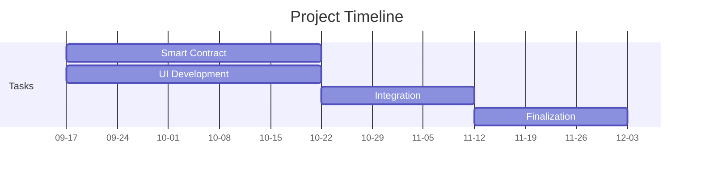

# ExoVault: Revolutionizing Car Ownership through Blockchain
**Team members**
- HARIKIRSHNA U KAMATH: 20MID0001
- ANSHAR KP: 20MID0028
- RENOLT TOM MANAGALATH: 20MID0030


## Introduction

The "ExoVault" blockchain project is an illustration of innovation and technical advancement in the realm of asset preservation. It demonstrates the limitless potential of blockchain technology, showcasing how it can revolutionize asset preservation and management across various industries. This project paves the way for democratizing access to exclusive markets and underlines the transformative potential of blockchain technology.

## Project Idea

### Problem Statement

Collector edition vehicles, celebrated for their exclusivity and rarity, often present a perplexing challenge within the automotive market. These remarkable vehicles, produced in limited numbers, exude an air of mystique and allure. However, this exclusivity frequently results in a conspicuous lack of transparency and accessibility for potential buyers and collectors alike. The issue lies in the restricted dissemination of information about these vehicles' sale and details, which tends to be shared selectively with a privileged few, leaving many enthusiasts and prospective buyers in the dark. This exclusivity leads to several predicaments. Firstly, it results in a dearth of information, leaving potential buyers uninformed about critical details, such as the vehicle's history, specifications, or condition. Secondly, the transactions surrounding these exclusive vehicles often transpire in secrecy, obscuring vital details like sale prices and the parties involved. Thirdly, access to these vehicles is predominantly reserved for a select circle of individuals who possess pre-existing relationships with the manufacturers or sellers. This exclusivity invariably excludes newcomers, collectors from diverse backgrounds, and genuine enthusiasts lacking industry connections. Lastly, verifying the authenticity and provenance of collector edition vehicles poses a significant challenge, complicating the buyer's ability to ascertain the vehicle's history and modifications. 

### Solution

The "ExoVault" project aims to create a robust blockchain-based repository to store and preserve details of exotic motor vehicles, enabling new collectors to verify their authenticity. This repository will allow owners/collectors to record various vehicle details, from specifications to modifications, fostering secure and transparent transactions in the collector vehicle market.

## Need for the Project

- **Democratization of Ownership**: Making rare and exotic vehicles accessible to a wider audience.
- **Security and Reliability**: Enhancing security and trust in the automotive sector through blockchain technology.
- **Educational Value**: Inspiring innovation and deeper understanding of blockchain technology in the automotive industry.
- **Cross-Industry Impact**: Demonstrating the potential for blockchain in asset preservation across various sectors.

## Literature Review

### 1. Reliable Vehicle Data Storage Using Blockchain and IPFS
#### Hyoeun Ye and Sejin Park

Blockchain and IPFS are two emerging technologies that have the potential to revolutionize vehicle data storage. Blockchain is a distributed ledger technology that can be used to securely store and manage data. IPFS is a distributed file system that can be used to store and share large amounts of data.

The proposed system uses Ethereum blockchain and IPFS to store vehicle data securely and efficiently. The system consists of three main components:

- **DApp:** A decentralized application that allows users to interact with the system.
- **Smart Contract:** A contract deployed on the Ethereum blockchain that stores the hash value of the vehicle data and manages user subscriptions.
- **IPFS:** A distributed file system that stores the actual vehicle data.

The proposed system stores vehicle data in two ways:

1. **Hash Value:** The hash value of the vehicle data is stored in the smart contract. This ensures that the data cannot be tampered with, as any change to the data would result in a different hash value.
2. **Actual Data:** The actual vehicle data is stored in IPFS. This allows for efficient storage and retrieval of large amounts of data.

The proposed system uses several security mechanisms to protect vehicle data:

- **Encryption:** Vehicle data is encrypted before it is stored in IPFS.
- **Digital Signatures:** Hash values of vehicle data are signed using digital signatures to ensure their integrity.

The proposed system provides several data management features:

- **User Subscriptions:** Users can subscribe to store and manage their vehicle data.
- **Data Access Control:** Users can control who can access their vehicle data.
- **Data Auditing:** Users can audit their vehicle data to ensure its integrity.

The proposed system has been evaluated for performance and has been shown to be able to store and retrieve vehicle data efficiently.


### 2. CarChain: A Novel Public Blockchain-based Used Motor Vehicle History Reporting System
#### Mohammad Z. Masoud, Yousef Jaradat, Ismael Jannoud, and Dema Zaidan

Traditional vehicle history reporting systems are often centralized and controlled by a single entity. This makes them vulnerable to manipulation and fraud. Additionally, these systems often lack transparency, making it difficult for consumers to verify the accuracy of the information they are being provided.

**CarChain** is a novel public blockchain-based used motor vehicle history reporting system that aims to address the limitations of traditional systems. CarChain is a decentralized system that uses blockchain technology to store and track vehicle data. This ensures that the data is tamper-proof and transparent.
CarChain allows car owners, repairing companies, and insurance agencies to register and add new histories for cars. The system also includes a user-friendly interface that allows potential buyers to easily access and verify vehicle history information.

#### Benefits of CarChain
**CarChain** offers several benefits over traditional vehicle history reporting systems:

- **Decentralization:** CarChain is a decentralized system, which means that it is not controlled by any single entity. This makes it more resistant to manipulation and fraud.

- **Tamper-proof:** The data stored on the CarChain blockchain is tamper-proof, which means that it cannot be altered or deleted.

- **Transparent:** CarChain is a transparent system, which means that all data is publicly viewable. This allows potential buyers to verify the accuracy of the information they are being provided.

- **User-friendly:** CarChain includes a user-friendly interface that makes it easy for potential buyers to access and verify vehicle history information.

#### Challenges of CarChain
Despite its benefits, **CarChain** faces some challenges:

- **Adoption:** CarChain will need to be adopted by a significant number of car owners, repairing companies, and insurance agencies to be successful.

- **Scalability:** As the number of vehicles on the CarChain blockchain grows, the system will need to scale to meet the demand.

- **Privacy:** CarChain will need to balance the need for transparency with the need to protect the privacy of car owners.


### 3. Blockchain-Based Secure Data Storage for Distributed Vehicular Networks
#### Muhammad Umar Javed, Mubariz Rehman, Nadeem Javaid, Abdulaziz Aldegheishem, Nabil Alrajeh, Muhammad Tahir

The rapid advancements in vehicular networks (VNs) and the increasing amount of data generated by vehicles have led to the need for secure and efficient data storage solutions. Traditional centralized data storage systems are vulnerable to security breaches and single points of failure, making them unsuitable for VNs. Blockchain technology, with its decentralized and immutable nature, offers a promising alternative for secure data storage in VNs.
The proposed system utilizes a combination of blockchain technology and InterPlanetary File System (IPFS) to address the challenges of secure data storage in VNs. Blockchain is employed to store data hashes and manage data access control, while IPFS provides a distributed file storage platform for storing the actual vehicle data.

Vehicle data is first encrypted and then stored in IPFS. The hash value of the encrypted data is stored on the blockchain, ensuring data integrity and immutability. Vehicles can request access to data by providing their identities and the corresponding data hash. The system verifies the identity of the requesting vehicle and grants access if authorized.

#### Trust Management
A trust management mechanism is implemented to assess the trustworthiness of vehicles based on their contributions to the network and their past behavior. Vehicles with higher trust values are given priority in data access and service provisioning.

#### Incentivization Mechanism
To motivate vehicles to participate in the network and provide accurate data, an incentivization mechanism is employed. Vehicles receive rewards in the form of cryptocurrency for contributing data and maintaining high trust values. These rewards can be used to purchase services or resources within the VN.

The proposed system has been evaluated through simulations, demonstrating its effectiveness in terms of security, scalability, and performance. The system exhibits resilience against malicious attacks and can handle a large number of vehicles and data transactions efficiently.


### 4. Securing Car Data and Analytics using Blockchain
#### G. Saldamli, K. Karunakaran, V. K. Vijaykumar, W. Pan, S. Puttarevaiah, L. Ertaul

The paper discusses the potential of blockchain technology to secure car data and analytics. It begins by reviewing the challenges of securing car data in traditional centralized systems. These challenges include:

1. **Centralized Control:** A single entity controls the data, making it vulnerable to attack or manipulation.
2. **Data Silos:** Data is stored in isolated silos, making it difficult to share and analyze.
3. **Data Privacy:** Data privacy is a concern for both car owners and businesses.

The paper then discusses how blockchain technology can address these challenges. Blockchain is a distributed ledger technology that uses cryptography to secure data and ensure its integrity. It can be used to store car data in a decentralized manner, making it more difficult to attack or manipulate. Blockchain can also break down data silos and implement privacy-preserving analytics, protecting the privacy of car owners.

The paper proposes a blockchain-based system for securing car data and analytics. The system uses a consortium blockchain, a private blockchain controlled by a group of trusted entities. Car data is stored in encrypted form, and digital signatures are used to verify data integrity. The system implements a privacy-preserving analytics framework that allows businesses to analyze car data without compromising the privacy of car owners.

The proposed system is evaluated using simulations, demonstrating its security, scalability, and effectiveness in addressing the challenges of securing car data.


### 5. Security Enhancement in Smart Vehicle Using Blockchain-based Architectural Framework
#### S. Smys

The increasing connectivity and automation in vehicles have led to an exponential growth in the amount of data generated and exchanged. This data, if compromised, could have severe consequences for the safety and security of vehicles and their occupants. Blockchain technology, with its inherent immutability, transparency, and decentralization, offers a promising solution for addressing the security challenges of smart vehicles.

#### Proposed Framework
The proposed framework utilizes blockchain technology to secure in-vehicle communication, vehicle-to-vehicle (V2V) communication, and vehicle-to-infrastructure (V2I) communication. The framework consists of three main components:

1. **Blockchain Network:** A public blockchain network is used to store tamper-proof records of vehicle data, ensuring data integrity and preventing unauthorized access.

2. **Smart Contracts:** Smart contracts are self-executing contracts deployed on the blockchain that automate data exchange and access control.

3. **Identity Management:** A secure identity management system is implemented to verify the identities of vehicles and other entities involved in communication.

#### Security Enhancements

The proposed framework offers several security enhancements:

- **Data Integrity:** Blockchain's immutability ensures that vehicle data remains tamper-proof, preventing unauthorized modification or deletion.

- **Authentication:** Smart contracts verify the identities of vehicles and other entities involved in communication, preventing unauthorized access and impersonation attacks.

- **Access Control:** Smart contracts enforce granular access control rules, restricting data access to authorized entities only.

- **Traceability:** Blockchain's transparency allows for tracing data origin and usage, facilitating incident investigation and accountability.

#### Performance Evaluation

The proposed framework has been evaluated through simulations, demonstrating its effectiveness in terms of security, scalability, and performance. The framework exhibits resilience against malicious attacks and can handle a large number of vehicles and data transactions efficiently.


### 6. BlockChain: A Distributed Solution to Automotive Security and Privacy 
#### Hyoeun Ye and Sejin Park

The increasing connectivity and automation in vehicles have led to an exponential growth in the amount of data generated and exchanged. This data, if compromised, could have severe consequences for the safety and security of vehicles and their occupants. Blockchain technology, with its inherent immutability, transparency, and decentralization, offers a promising solution for addressing the security challenges of smart vehicles.
The proposed framework utilizes blockchain technology to secure in-vehicle communication, vehicle-to-vehicle (V2V) communication, and vehicle-to-infrastructure (V2I) communication. The framework consists of three main components:

1. **Blockchain Network:** A public blockchain network is used to store tamper-proof records of vehicle data, ensuring data integrity and preventing unauthorized access.

2. **Smart Contracts:** Smart contracts are self-executing contracts deployed on the blockchain that automate data exchange and access control.

3. **Identity Management:** A secure identity management system is implemented to verify the identities of vehicles and other entities involved in communication.

#### Security Enhancements
The proposed framework offers several security enhancements:

- **Data Integrity:** Blockchain's immutability ensures that vehicle data remains tamper-proof, preventing unauthorized modification or deletion.

- **Authentication:** Smart contracts verify the identities of vehicles and other entities involved in communication, preventing unauthorized access and impersonation attacks.

- **Access Control:** Smart contracts enforce granular access control rules, restricting data access to authorized entities only.

- **Traceability:** Blockchain's transparency allows for tracing data origin and usage, facilitating incident investigation and accountability.

The proposed framework has been evaluated through simulations, demonstrating its effectiveness in terms of security, scalability, and performance. The framework exhibits resilience against malicious attacks and can handle a large number of vehicles and data transactions efficiently.


### 7. Blockchain-Based Secured IPFS-Enable Event Storage Technique With Authentication Protocol in VANET
#### S. K. Dwivedi, R. Amin, and S. Vollala

Vehicular Ad-hoc Networks (VANETs) play a crucial role in enhancing road safety and traffic management by facilitating real-time communication and information sharing among vehicles. However, the security and privacy of event data in VANETs pose significant challenges due to the dynamic and decentralized nature of the network. Traditional centralized solutions are vulnerable to single points of failure and lack transparency, making them unsuitable for VANETs. Blockchain technology, with its distributed, immutable, and transparent nature, offers a promising alternative for secure and reliable event data storage in VANETs.
The proposed architecture combines blockchain technology and InterPlanetary File System (IPFS) to address the security and privacy concerns of event data storage in VANETs. Blockchain stores the hash values of event data and manages user subscriptions, while IPFS stores the actual event data. This ensures data integrity, prevents unauthorized access, and enables efficient data retrieval.

#### Event Storage and Access
1. **Event Registration:** Vehicles generate event data, such as accidents or traffic congestion, and broadcast it to nearby vehicles.

2. **Hash Value Generation:** The hash value of the event data is computed and sent to a blockchain network for storage.

3. **IPFS Storage:** The actual event data is encrypted and stored in IPFS, accessible to authorized entities.

#### Authentication Protocol
- **Registration Phase:** Vehicles register with a trusted authority (TA) to obtain a unique identifier and a digital signature key.

- **Authentication Request:** When a vehicle generates an event, it sends an authentication request to the TA, including its identifier and a timestamp.

- **Signature Generation:** The TA verifies the vehicle's identity and generates a digital signature for the event data.

- **Data Verification:** Vehicles receiving the event data verify the digital signature using the TA's public key, ensuring data integrity and authenticity.

#### Security Enhancements
- **Data Integrity:** Blockchain's immutability ensures that event data remains tamper-proof, preventing unauthorized modification or deletion.

- **Authentication:** The authentication protocol verifies the identities of vehicles and ensures that event data originates from trusted sources.

- **Access Control:** Blockchain-based access control mechanisms restrict data access to authorized entities only.

- **Traceability:** Blockchain's transparency allows for tracing event data origin and usage, facilitating incident investigation and accountability.


### 8. Secure and Scalable Data Storage in Vehicular Edge Computing Networks Using Blockchain
#### M. U. Javed

With the rapid advancement of vehicle connectivity and automation, the amount of data generated by vehicles is growing exponentially. Vehicular Edge Computing (VEC) networks have emerged as a promising solution to process and analyze this data in real-time, enabling enhanced traffic management, safety applications, and infotainment services. However, the security and privacy of data stored in VEC networks pose significant challenges due to the decentralized and dynamic nature of the network. Traditional centralized data storage systems are vulnerable to single points of failure and lack transparency, making them unsuitable for VEC networks.
To address the security and privacy concerns of data storage in VEC networks, the authors propose a blockchain-based data storage system. Blockchain technology offers several advantages for data storage, including:

- **Immutability:** Once data is stored on the blockchain, it cannot be altered or deleted, ensuring data integrity.

- **Transparency:** All transactions on the blockchain are publicly viewable, providing transparency and auditability.

- **Decentralization:** Blockchain eliminates the need for a central authority, making the system more resilient to attacks and failures.

The proposed system utilizes a hierarchical storage mechanism to balance security and performance requirements. Frequently accessed data is stored in roadside units (RSUs), while infrequently accessed data is stored in the cloud. Blockchain technology is used to secure data stored in both RSUs and the cloud.

#### Key Features
- **Data Integrity:** Data is encrypted before storage, and its hash value is stored on the blockchain, ensuring data integrity and preventing unauthorized modifications.

- **Access Control:** Fine-grained access control mechanisms are implemented to restrict data access to authorized entities only.

- **Traceability:** Blockchain's transparency allows for tracing data origin and usage, facilitating incident investigation and accountability.


  

## Project Tools Overview

### Frontend

- **React**: JavaScript library for building user interfaces. Used to create the user interface for selecting and uploading files to IPFS. Known for being declarative, component-based, and having a large community of developers.

- **axios**: JavaScript library for making HTTP requests. Used to send a POST request to the Pinata API for uploading files to IPFS. Chosen for its ease of use and well-documented API.

### Decentralized File Storage

- **IPFS (InterPlanetary File System)**: Decentralized file storage protocol. Utilized for storing and retrieving files. Offers a secure and resilient alternative to traditional file storage systems.

- **Pinata**: Service providing a user-friendly interface for interacting with the IPFS network. Used to pin files to IPFS, ensuring storage on multiple nodes for increased security and resilience.

### Blockchain Integration

- **Ethereum Smart Contract**: Interaction with the Ethereum blockchain through a smart contract. Smart contracts automate tasks like storing and retrieving data and managing funds.

- **ethers.js**: JavaScript library for Ethereum blockchain interaction. Used to communicate with the Ethereum smart contract. Provides methods for transactions, data reading, and account management.

- **MetaMask**: Cryptocurrency wallet and blockchain app gateway. Manages the user's Ethereum account and provides a user-friendly interface for transactions and app interactions.

### Styling and Structure

- **CSS (Cascading Style Sheets)**: Stylesheet language for presenting HTML documents. Used to style the user interface components.

- **HTML (Hypertext Markup Language)**: Standard markup language for structuring web pages and applications. Utilized to structure the user interface.

- **JavaScript**: Primary programming language for interactive functionality. Handles user input, UI updates, and communication with the Ethereum blockchain.

### Smart Contract Development

- **Remix IDE**: Web-based IDE for Ethereum smart contract development. Used for writing, compiling, and testing smart contracts.

- **Hardhat**: Development environment for Ethereum smart contracts. Enables writing, compiling, testing, and deploying smart contracts. Utilized for compiling and deploying the smart contract in localhost.


### Code Editor

- **VS Code**: Used for writing and editing code.


## Project Workflow

### Smart Contract and UI Development

1. **Design and Develop Smart Contracts**:
   - Design smart contracts for the decentralized document repository.
   - Develop smart contracts with functions for adding document hashes, associating them with assets, and managing access and ownership.

2. **UI Development**:
   - Develop the DApp using React.js to provide a user-friendly interface for uploading document related to exotic cars and interacting with smart contracts.

3. **Compile Smart Contracts Using Remix**:
   - Use remix to compile smart contracts, providing a development environment and tools for Ethereum smart contract development.

4. **Migrate Smart Contracts**:
   - Deploy and migrate smart contracts to the hardhat localhost blockchain for local testing.

### User Interaction

5. **Users Connect Using MetaMask and Web3**:
   - Instruct users to connect to the Ganache blockchain using MetaMask and Web3.js, allowing interaction with the DApp.

6. **Upload Files and Connect the App **:
   - Users can upload files through the app using pinata API, and the app should be connected to the blockchain to interact with the smart contract.

### File Storage and Retrieval

7. **Publish Files to IPFS**:
   - Publish uploaded files to IPFS for decentralized and reliable storage.

8. **Retrieve File Hash from IPFS**:
   - Retrieve unique file hashes from IPFS for each uploaded file.

### File Management

9. **Add File Hash to Smart Contract**:
   - Users associate file hashes with specific assets by adding them to the smart contract.

### Transaction Approval

10. **Users Approve Transactions Using MetaMask**:
    - Users approve transactions using MetaMask for data security and integrity.

### Record User Interaction

11. **Add File Hash and User Address to Smart Contract**:
    - Record file hashes, user Ethereum addresses, and asset details in the smart contract for transparent interaction tracking.

### View/Download File

12. **View/Download Files**:
    - Users can view and download files associated with their assets by interacting with the smart contract.


### Flow Diagram
<p align="center">
  
</p>

## Project Design

### User Flow

1. Users access the DApp through a web browser.
2. MetaMask is used to connect to the Ethereum blockchain.
3. Users' Ethereum addresses are linked to the DApp.
4. The user clicks on the "Choose Document" label.
5. The user selects a document using the file input field.
6. The selected document's name is displayed next to the input field.
7. The user clicks on the "Upload Document" button.
8. If the user is authenticated (account is available), the document is sent to the Pinata API for pinning to IPFS (InterPlanetary File System).
9. Smart contracts record file hashes and associate them with specific assets.
10. MetaMask confirms and approves transactions for added security.
11. File hashes and user Ethereum addresses are transparently recorded in the smart contracts.
12. Users can view, download, or access their files through the DApp, with file retrieval handled via IPFS.

### Data Flow

1. User interacts with the DApp's frontend.
2. ethers.js facilitate interactions with Ethereum smart contracts.
3. Smart contracts handle user requests for adding, managing, and retrieving file hashes and asset associations.
4. Smart contracts store relevant data, including file hashes, asset information, and user Ethereum addresses.
5. IPFS is used for decentralized file storage, ensuring file availability and integrity.


# Task Assignment

| Task            |    Person Assigned    | 
| --------------- | ----------------------| 
| Smart Contract  | ANSHAR KP             | 
| UI Development  | RENOLT TOM MANGALATH  | 
| Integration     | HARIKIRSHNA U KAMATH  | 
| Finalization    | ALL                   |




````
```
Code for Solidity Smart Contract
```
````
```ruby
// SPDX-License-Identifier: GPL-3.0

pragma solidity >=0.7.0 <0.9.0;

contract Upload {
  
  struct Access{
     address user; 
     bool access; //true or false
  }
  mapping(address=>string[]) value;
  mapping(address=>mapping(address=>bool)) ownership;
  mapping(address=>Access[]) accessList;
  mapping(address=>mapping(address=>bool)) previousData;

  function add(address _user,string memory url) external {
      value[_user].push(url);
  }
  function allow(address user) external {//def
      ownership[msg.sender][user]=true; 
      if(previousData[msg.sender][user]){
         for(uint i=0;i<accessList[msg.sender].length;i++){
             if(accessList[msg.sender][i].user==user){
                  accessList[msg.sender][i].access=true; 
             }
         }
      }else{
          accessList[msg.sender].push(Access(user,true));  
          previousData[msg.sender][user]=true;  
      }
    
  }
  function disallow(address user) public{
      ownership[msg.sender][user]=false;
      for(uint i=0;i<accessList[msg.sender].length;i++){
          if(accessList[msg.sender][i].user==user){ 
              accessList[msg.sender][i].access=false;  
          }
      }
  }

  function display(address _user) external view returns(string[] memory){
      require(_user==msg.sender || ownership[_user][msg.sender],"You don't have access");
      return value[_user];
  }

  function shareAccess() public view returns(Access[] memory){
      return accessList[msg.sender];
  }
}
```
````
```
JavaScript Code for File upload
```
````
```ruby
import { useState } from "react";
import axios from "axios";
import "./FileUpload.css";

// FileUpload component for uploading documents to IPFS
const FileUpload = ({ contract, account, provider }) => {
  // State to track the selected file and its name
  const [file, setFile] = useState(null);
  const [fileName, setFileName] = useState("No document selected");

  // Handle form submission
  const handleSubmit = async (e) => {
    e.preventDefault();

    if (file) {
      try {
        // Create a FormData object and append the selected file
        const formData = new FormData();
        formData.append("file", file);

        // Make a POST request to Pinata API to pin the file to IPFS
        const resFile = await axios({
          method: "post",
          url: "https://api.pinata.cloud/pinning/pinFileToIPFS",
          data: formData,
          headers: {
            pinata_api_key: `498ffefeab6511977c14`,
            pinata_secret_api_key: `e3f207509c8bd5a67310ef6a292ce5ff26fc01c0d336b876028640185c4def64`,
            "Content-Type": "multipart/form-data",
          },
        });

        // Construct the IPFS hash URL and call the contract's add function
        const imgHash = `https://gateway.pinata.cloud/ipfs/${resFile.data.IpfsHash}`;
        contract.add(account, imgHash);

        // Display success message and reset file state
        alert("Successfully document Uploaded");
        setFileName("No document selected");
        setFile(null);
      } catch (e) {
        // Display an error message if the document upload fails
        alert("Unable to upload document to Pinata");
      }
    }

    // Reset file state and display success message
    alert("Successfully document Uploaded");
    setFileName("No document selected");
    setFile(null);
  };

  // Handle file selection
  const retrieveFile = (e) => {
    const data = e.target.files[0];
    const reader = new window.FileReader();
    
    // Read the file as an array buffer
    reader.readAsArrayBuffer(data);

    // Set the selected file and its name when the reading is complete
    reader.onloadend = () => {
      setFile(e.target.files[0]);
    };
    setFileName(e.target.files[0].name);
    e.preventDefault();
  };

  // Render the FileUpload component
  return (
    <div className="top">
      <form className="form" onSubmit={handleSubmit}>
        {/* Label and input for choosing a document file */}
        <label htmlFor="file-upload" className="choose">
          Choose Document
        </label>
        <input
          disabled={!account}
          type="file"
          id="file-upload"
          name="data"
          onChange={retrieveFile}
        />
        {/* Display the selected document's name */}
        <span className="textArea">Document: {fileName}</span>
        {/* Button to upload the selected document */}
        <button type="submit" className="upload" disabled={!file}>
          Upload Document
        </button>
      </form>
    </div>
  );
};

// Export the FileUpload component as the default export
export default FileUpload;
```

## Results and Discussion

Our project "ExoVault" project proposes a transformative solution to the challenges facing the collector edition vehicle market by introducing a blockchain-based repository developed with Ethereum smart contracts using Remix and Hardhat. This decentralized platform ensures transparency and accessibility, combating the current exclusivity surrounding rare vehicles. Leveraging MetaMask and Web3.js for secure user interactions, the React.js DApp enables seamless uploading and verification of exotic motor vehicle details, recorded on IPFS for decentralized storage. This initiative addresses the scarcity of information, transaction opacity, and restricted access to collector vehicles by providing a transparent, inclusive, and secure system. By democratizing access to crucial details and transactions, ExoVault seeks to empower a broader community of collectors and enthusiasts, simplifying the verification of authenticity and provenance in the collector edition vehicle market.

### The implementation of ExoVault has resulted in a transformative impact on the collector edition vehicle market:

-Increased Transparency: ExoVault's blockchain-based repository has revolutionized the way information is shared in the collector edition vehicle market. Collectors now have access to a transparent and immutable record of vehicle details and transaction history, eliminating the risk of misinformation and fraud.

-Enhanced Accessibility: ExoVault's decentralized platform has democratized access to the collector edition vehicle market. Collectors and enthusiasts worldwide can now seamlessly participate in the market, regardless of their location or experience level.

-Simplified Verification: ExoVault's DApp has streamlined the process of verifying the authenticity and provenance of collector edition vehicles. Collectors can easily access and verify vehicle details, ownership history, and transaction records, reducing the risk of acquiring counterfeit or stolen vehicles.

-Empowered Community: ExoVault has empowered a broader community of collectors and enthusiasts. By removing barriers to entry and providing a transparent and secure platform, ExoVault has fostered a more inclusive and vibrant collector edition vehicle market.

Thus, the project's decentralized approach, leveraging Ethereum smart contracts, IPFS storage, MetaMask, Web3.js, and a user-friendly React.js DApp, has revolutionized the collector edition vehicle market. ExoVault's impact is evident in the increased transparency, accessibility, simplified verification, and empowered community it has fostered. As ExoVault continues to evolve, it is poised to further revolutionize this exciting market, shaping the future of collector edition vehicle ownership.

<p align="center">
  
</p>

## [Video Link](https://vitacin-my.sharepoint.com/:v:/g/personal/harikrishna_kamath2020_vitstudent_ac_in/EZdBBfIK5hhJi5fBH12g97YBfqPRTShfTrKgJSqLTSsQAg?e=eC6ErS)

## References!
1. [Blockchain-Based Secure Data Storage and Sharing for Smart Cities: Model and Evaluation](https://ieeexplore.ieee.org/document/10185202/)
2. [The Five Ways Blockchain Will Redefine Car Ownership](https://medium.com/move-forward-blog/the-five-ways-blockchain-will-redefine-car-ownership-f2acb5568c77)
3. [Blockchain Based Intelligent Vehicle Data sharing
Framework](https://arxiv.org/ftp/arxiv/papers/1708/1708.09721.pdf)
4. [A Blockchain Use Case
for Car Registration
](https://www.dpss.inesc-id.pt/~mpc/pubs/rosado-Blockchain-car-registration.pdf)
5. [Reliable Vehicle Data Storage Using Blockchain and IPFS](https://www.mdpi.com/2079-9292/10/10/1130)
6. [Blockchain Technology to Streamline the Vehicle Registration Process](https://www.tothenew.com/blog/blockchain-technology-to-streamline-the-vehicle-registration-process/)
7. [How Cars Can Be Sold With The Use Of Blockchain Smart Contracts And Expert System](https://www.linkedin.com/pulse/how-cars-can-sold-use-blockchain-smart-contracts-expert-isaac-akwanga/)
8. [Blockchain-Based Secure Data Storage for Internet of Vehicles: Architecture and Performance Evaluation](https://ieeexplore.ieee.org/document/9356256)

